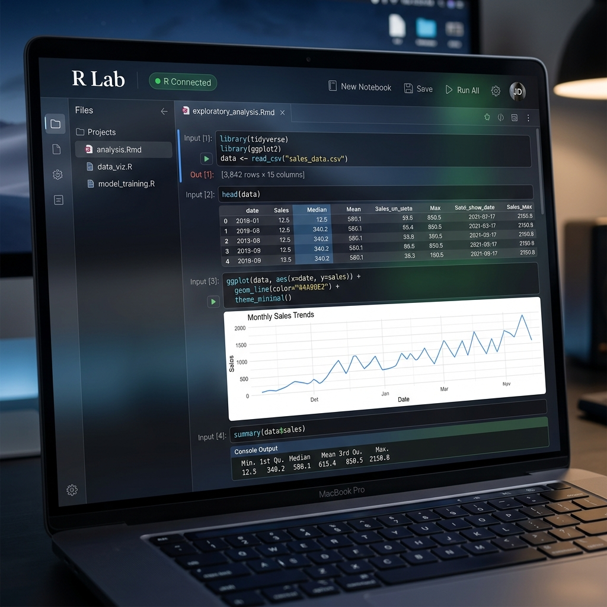

# R Lab 🧪

R Lab は、ローカルの R 環境と連携して動作する、軽量で直感的、かつモダンなインタラクティブ R ノートブック・デスクトップアプリケーションです。

Tauri と CodeMirror 6 を基盤にしており、Jupyter Notebook のような操作感と、ローカル R インスタンスの高速な実行性能を非常に軽量なデスクトップアプリとして提供します。

---

## 📥 ダウンロード (ビルド済みインストーラー)

手動でコンパイルすることなく、すぐにアプリを使用したい場合は、以下のビルド済みインストーラーをダウンロードして実行してください：

👉 **[Windows用インストーラー (R_Lab_0.1.0_x64-setup.exe) を直接ダウンロード](./releases/R_Lab_0.1.0_x64-setup.exe)**

> [!NOTE]
> アプリを動作させるには、お使いのPCに **[R (R-project)](https://www.r-project.org/)** がインストールされ、環境変数 `PATH` に設定されている必要があります。

---

## 🎨 スクリーンショット

---

## ✨ 主な機能

- **📓 インタラクティブなノートブック UI**
  - Jupyter Notebook のようにセル単位で R コードを編集・実行できます。
  - セルを追加（`＋ セルを追加`）したり、不要なセルを即座に削除（`✕`）できます。
  - `Shift + Enter` で現在のセルを実行し、自動的に次のセルへ移動（無ければ新規作成）する快適な操作感を提供します。

- **📝 インテリジェントなコードエディタ (CodeMirror 6)**
  - 括弧や引用符（`()`, `{}`, `[]`, `""`, `''`）の自動補完・自動閉じに対応。
  - **R 関数の自動補完予測機能**: 入力中に一致する R 関数候補をポップアップ表示します。手動で `Ctrl + Space` を押して候補を表示することも可能です。

- **⚙️ 強力な R 実行エンジンとエラー収集**
  - Rust による R セッション制御により、標準出力（stdout）だけでなく、警告や詳細なエラー情報（stderr）も漏らさず取得し、ノートブック上に綺麗に出力します。
  - `install.packages(...)` を実行した際にも、CRAN リラーの自動解決（options repos）が行われ、エラーにならずパッケージがインストールできます。
  - アプリ起動時にシステム内の R の有無をチェックし、ヘッダーにステータス（`R 接続 OK` / `R 未検出`）を分かりやすく表示します。

- **🌓 システム自動連動のテーマ切り替え**
  - OS の外観設定（ダーク・ライトテーマ）を自動検出し、初期設定として適用します。
  - ヘッダーの切り替えボタンから、手動でライトモードとダークモードをいつでもトグル可能です。

- **⚡ 超軽量 & デスクトップ最適化**
  - Electron 等の肥大化したエンジンを使用せず、Tauri v2 を採用することで、起動は数秒、メモリ消費も極限まで抑えられた軽量設計を実現しています。

---

## 🚀 はじめに (前提条件)

アプリを使用するには、お使いのPCに **[R (R-project)](https://www.r-project.org/)** がインストールされ、環境変数 `PATH` に設定されている必要があります（コマンドプロンプトやPowerShellで `R --version` が実行できる状態）。

Rがインストールされていれば、ダウンロードした `.exe` ファイルを起動するだけで、すぐに R Lab ノートブックをご利用いただけます。

---

## 📄 ライセンス

このプロジェクトは [MIT License](./LICENSE) に基づいてライセンスされています。

Copyright (c) 2026 fasly
