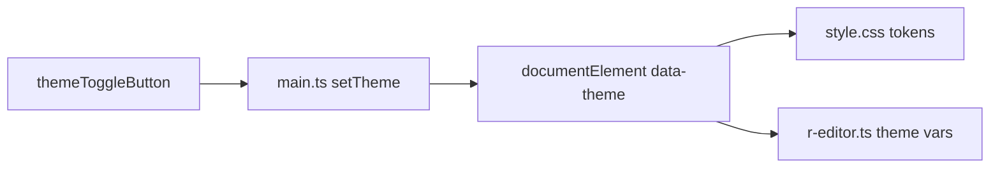

# ライト/ダーク切替の配色改善プラン

## 目的

「vibecoding感」の強い配色をやめ、**落ち着いた実用UI**として
- ライトモード
- ダークモード
を切り替え可能にする（CodeMirror 補完UIを含む）。

## 変更方針

- 色をベタ書きせず、[c:\Users\shunk\Desktop\R\src\style.css](c:\Users\shunk\Desktop\R\src\style.css) に **CSS変数トークン**を定義。
- ルート要素に `data-theme="light" | "dark"` を付け替えて切替。
- [c:\Users\shunk\Desktop\R\src\main.ts](c:\Users\shunk\Desktop\R\src\main.ts) でテーマトグルUI（ヘッダー右）を追加。
- [c:\Users\shunk\Desktop\R\src\r-editor.ts](c:\Users\shunk\Desktop\R\src\r-editor.ts) は CSS 変数参照にして、CodeMirror のエディタ面・補完ポップアップ・選択色を同期。

## 実装タスク

1. **テーマトークン化**（style.css）
- `:root` に共通トークン、`[data-theme="light"]` / `[data-theme="dark"]` に実値。
- 対象: 背景、サーフェス、境界線、本文文字、補助文字、primary、danger、badge。

2. **テーマ切替UI**（main.ts）
- ヘッダーに `テーマ切替` ボタン（またはセグメント）追加。
- 初期値: OS設定優先（`prefers-color-scheme`）→ 未設定時ライト。
- ユーザー選択は `localStorage` 保存（次回起動で復元）。

3. **CodeMirror連動**（r-editor.ts）
- 現在の固定色を CSS 変数に置換。
- 補完ポップアップ（背景/境界/選択行）も同一トークンで統一。
- テーマ変更時に EditorView の再作成なしで反映できるよう、変数参照中心にする。

4. **微調整**（style.css）
- run/remove/add ボタンのコントラスト調整。
- バッジ色の彩度を落とし、ステータス判読性を維持。

## 影響ファイル

- [c:\Users\shunk\Desktop\R\src\style.css](c:\Users\shunk\Desktop\R\src\style.css)
- [c:\Users\shunk\Desktop\R\src\main.ts](c:\Users\shunk\Desktop\R\src\main.ts)
- [c:\Users\shunk\Desktop\R\src\r-editor.ts](c:\Users\shunk\Desktop\R\src\r-editor.ts)

## 受け入れ基準

- 1クリックでライト/ダークが切替。
- ページ再起動後も選択テーマが保持。
- エディタ本文・補完ポップアップ・ボタン・バッジが両テーマで破綻しない。
- 文字と背景の可読性（コントラスト）が明確。