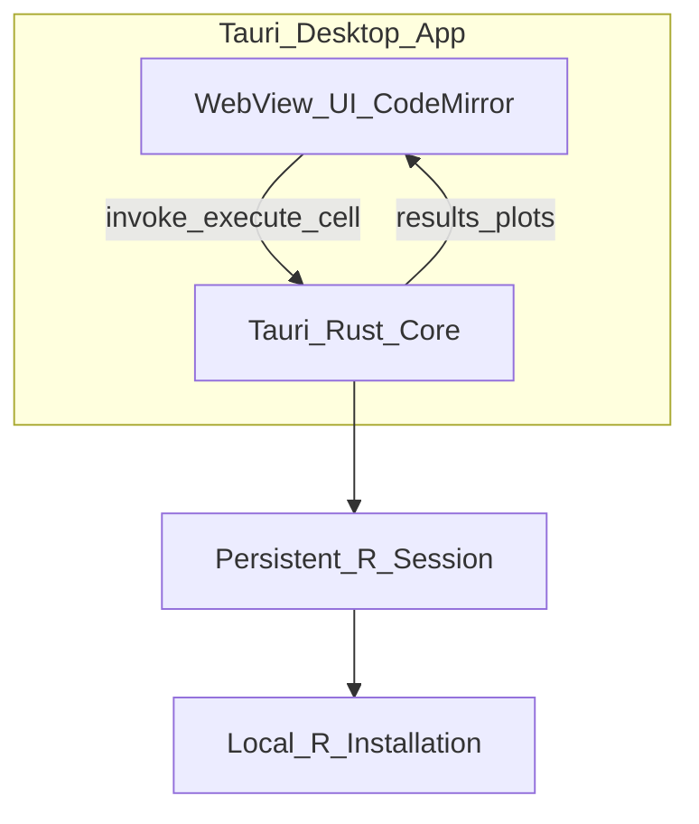

# ローカルRノートブック（デスクトップ版）構築プラン

## ユーザー確定方針

| 項目 | 選択 |
|------|------|
| **利用形態** | デスクトップアプリ（Electron / Tauri、RStudioに近い感じ） |
| **HPとの関係** | **完全に別環境**（別フォルダ・別リポジトリ。HPは変更しない） |

---

## 結論：いける

デスクトップアプリなら、ローカルファイルへのアクセス・ウィンドウ統合・R実行プロセスの寿命管理がブラウザ単体より自然で、**RStudio代替としての体験**に向いている。Colab風の**セル単位実行**はUI層で実装し、裏側で**永続Rセッション**を1本立ててセル間で変数を共有する。



---

## 推奨スタック

| 層 | 技術 | 理由 |
|----|------|------|
| シェル | **Tauri 2** | Electronより軽量・起動が速い。Windows向け配布しやすい |
| UI | **Vite + TypeScript** + **CodeMirror 6** | セルエディタ・Rシンタックス |
| R連携 | **Rserve**（第一候補）または **R 子プロセス** | 永続セッション・プロット取得が確立されたパターン |
| 保存 | 自前 **`.rnb`**（JSON） | セル配列 + メタデータ。将来 `.ipynb` も検討可 |

**HP（[c:\Users\shunk\Desktop\HP](c:\Users\shunk\Desktop\HP)）は一切触らない。** 新規プロジェクトは例として `c:\Users\shunk\Desktop\r-lab\` に独立配置。

---

## UI構成（確定レイアウト）

**3ペイン構成**。プロット専用ペインは持たず、**ggplot 等の画像はセル出力内にインライン表示**（Colab/Jupyter と同様）。

```
┌─────────────────────────────────────────────────────────┐
│ メニュー: ファイル / 実行 / 設定                          │
├──────────────────────────┬──────────────────────────────┤
│ ノートブック（セル縦並び）        │ 環境（変数名一覧）簡易版      │
│  [code cell 1] [▶]         │                              │
│  [output: テキスト + 画像]   │  name    class    dim         │
│  [code cell 2]              │  df      data.frame 100x5     │
│  ...                        │  ...                         │
├──────────────────────────┴──────────────────────────────┤
│ コンソール（REPL・1行入力）                               │
└─────────────────────────────────────────────────────────┘
```

| 領域 | 役割 |
|------|------|
| **上左（メイン）** | コードセル + 実行ボタン。直下に stdout / エラー / **プロット画像** |
| **上右（サイドバー）** | 環境ペイン。`ls()` ベースの変数名・型・次元（クリックで詳細は Phase 2） |
| **下（全幅）** | コンソール REPL。1行入力 + 履歴スクロール |
| **メニュー** | ファイル（新規/開く/保存）、実行（セル/すべて）、設定（Rパス） |

**レイアウト実装**: CSS Grid または flex で、上段を `1fr | 280px`、下段コンソールを固定高（例: 180px、リサイズ可は Phase 2）。

- **セル**: `Shift+Enter` で実行 → 次セルへ
- **出力ブロック**: テキスト出力の下に `` でプロットを並べる（1セルに複数プロット可）
- **環境ペイン**: セル実行後に自動更新（`get_env_snapshot` を Tauri 経由で呼ぶ）
- **コンソール**: ノートブックと同一 R セッションを共有

---

## R連携の設計

### 方式A — Rserve（推奨）

1. アプリ起動時に `Rserve` パッケージ経由でローカルTCPサーバを起動（`127.0.0.1` のみ）
2. Tauri（Rust）から **Rserve プロトコル**で `eval` → 結果・エラーを取得
3. プロットは評価前後で R 側 `png(dev)` → バイナリ取得 → **該当セルの output 領域**にインライン表示

- メリット: セッションが安定、Rコミュニティで実績あり
- 前提: 初回のみ `install.packages("Rserve")`（設定画面で案内）

### 方式B — R 子プロセス（フォールバック）

- `R --vanilla` を常駐させ、一時 `.R` スクリプト or 名前付きパイプでセルコードを送受信
- Rserve が入らない環境向け

**実行モデル**: ノートブック1ファイル = Rセッション1つ。セル間で `library()`・変数を共有。

---

## プロジェクト構成案

```
Desktop/
├── HP/                    # 既存（変更なし）
└── r-lab/                 # 新規・独立
    ├── src/                 # フロント（セルUI・レイアウト）
    ├── src-tauri/           # Rust（R起動・IPC・ファイルDLG）
    │   ├── src/
    │   │   ├── main.rs
    │   │   ├── r_session.rs # Rserve / subprocess
    │   │   └── commands.rs  # execute_cell, save, open
    │   └── tauri.conf.json
    ├── package.json
    └── notebooks/           # サンプル .rnb
```

---

## MVP機能

1. コードセルの追加・削除・並べ替え・`Shift+Enter` 実行
2. セル出力（stdout / エラー / 警告 + **セル内インライン**プロット）
3. 右ペイン環境一覧（変数名・型・次元の簡易表示、実行後に更新）
4. 下ペインコンソールREPL（1行ずつ評価、ノートブックとセッション共有）
5. `.rnb` の保存・開く（OSネイティブダイアログ）
6. **設定**: R.exe のパス（自動検出 + 手動指定）
7. `npm run tauri dev` で開発、`tauri build` で配布物生成

**Phase 2以降**: 環境ペインの変数クリック詳細（`str()`）、ペインリサイズ、補完、複数タブ、`.ipynb` インポート、テーマ切替

---

## 実装フェーズ

### Phase 1 — 起動して1セル実行
- Tauri + 空レイアウト + CodeMirror 1セル
- R検出 → Rserve起動 → `1+1` が返るところまで

### Phase 2 — ノートブック体験
- 複数セル・セル内出力（テキスト + プロット）・環境ペイン連動
- `.rnb` 保存/読込

### Phase 3 — 磨き込み
- 環境ペイン詳細・コンソール/サイドバーのリサイズ
- 実行タイムアウト・エラー表示の改善

### Phase 4 — 配布
- Windows `.msi` / ポータブル `.exe`
- 初回セットアップウィザード（Rパス・Rserveインストール案内）

---

## 前提・環境

実装開始時に確認:

1. **R** — `where.exe R`（PowerShellの `R` エイリアスと区別）
2. **Rust toolchain** — Tauriビルド用（`rustup`）
3. **Node.js 18+** — フロントビルド用

---

## リスクと対策

| リスク | 対策 |
|--------|------|
| Rserve 未インストール | 初回起動で `install.packages` 案内 or 同梱スクリプト |
| RのPATH未設定 | 設定画面で `R_HOME` / `bin` を手動指定 |
| Tauri + Rserve のRustバインディング | まずTCPソケットで最小プロトコル実装、後でクレート整理 |
| 巨大プロット | 解像度上限・リサイズ |

---

## やらないこと（スコープ外）

- HPリポジトリへの統合・リンク追加
- クラウド同期・マルチユーザー
- RStudio全機能の完全再現（デバッガ・Git UI等は将来検討）
