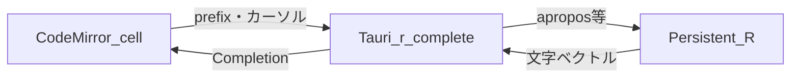

# R の関数予測（オートコンプリート）実装プラン

## 結論

**実装できる。** ただし現状の [src/main.ts](c:\Users\shunk\Desktop\R\src\main.ts) は **`<textarea>` + [src/brackets.ts](c:\Users\shunk\Desktop\R\src\brackets.ts)** のため、Jupyter/RStudio 風の **候補ポップアップ・部分一致・引数ヒント** には **専用エディタ**がほぼ必須。**CodeMirror 6**（プランの元ノートブック案と整合）を推奨する。

## アプローチ比較

| 方式 | 内容 | メリット | デメリット |
|------|------|----------|------------|
| **A. CodeMirror + R 呼び出し** | `invoke("r_complete", { prefix })` で `apropos(paste0("^", reg.escape(prefix)))` 等 | ロード済みパッケージ・ユーザー定義まで反映 | レイテンシ・エスケープ・結果件数制限が必要 |
| **B. 静的リストのみ** | base 関数名を JSON で抱える | 高速・オフライン | パッケージ・自作関数は出ない |
| **C. LSP（languageserver）** | 別プロセスと LSP 連携 | 定義ジャンプ等まで可能 | 重い・Windows 配布が難しい |

**推奨**: **A を主**、初回やエラー時のフォールバックに **B の薄いリスト**（任意）。

## 技術タスク

1. **依存追加**（[package.json](c:\Users\shunk\Desktop\R\package.json)）  
   - `@codemirror/state`, `@codemirror/view`, `@codemirror/lang-javascript` は不要。  
   - `@codemirror/codemirror` メタではなく個別パッケージ: `@codemirror/state`, `@codemirror/view`, `@codemirror/commands`, `@codemirror/language`, `@codemirror/autocomplete`, `@codemirror/theme-one-dark`（テーマ任意）  
   - R 用公式パッケージは安定版が少ないため、**`@lezer/highlight` + 既存の軽量 R ハイライト**は後回しでも可。まずは `defaultHighlightStyle` またはプレーンテキスト + 補完のみでもよい。

2. **セル編集を CodeMirror に差し替え**（[src/main.ts](c:\Users\shunk\Desktop\R\src\main.ts)）  
   - 各セルで `EditorView` を `section` 内のコンテナ（`div.cm-host`）にマウント。  
   - 高さは `minHeight` + `EditorView.theme` で現状の textarea に近づける。  
   - **Shift+Enter**: `Prec.high` の keymap で実行 + 次セルへ（textarea 時代と同じ挙動）。  
   - **既存の括弧補完**: CodeMirror の **`closeBrackets()`** に置き換え可能 → [brackets.ts](c:\Users\shunk\Desktop\R\src\brackets.ts) は削除または未使用化。

3. **Tauri コマンド `r_complete`**（新規または [commands.rs](c:\Users\shunk\Desktop\R\src-tauri\src\commands.rs)）  
   - 引数: `prefix: String`, オプション `limit: usize`（例 50）。  
   - R 側は永続セッションで評価: 例）`unique(head(apropos(paste0("^", prefix), mode = "function"), n))` と **`mode` の切り替え**（関数だけ / すべて）をフラグで。  
   - **`prefix` のエスケープ**: R で `gsub` または Rust 側で正規表現メタ文字を除去し、`apropos` には固定文字列プレフィックスとして渡す。  
   - 戻り値: `Vec<String>` または `{ label, detail? }`（`args` は `formals` 取得で Phase 2）。

4. **補完ソース**（フロント）  
   - `autocompletion({ override: [rCompletions] })`  
   - `rCompletions(context)` でカーソル前の識別子プレフィックスを抽出（簡易: `/[a-zA-Z._][a-zA-Z0-9._]*$/`）。  
   - **デバウンス**（150–300ms）+ **キャンセル**（古いリクエスト無視）で連打に強くする。  
   - `invoke` 失敗時は空配列。

5. **UX**  
   - `Ctrl+Space` で手動オープン（CodeMirror デフォルトと整合）。  
   - 候補のスクロール・色は One Dark 系で既存 UI に合わせる。

## リスク・注意

- `apropos("^x")` は **大量ヒット**しうる → **limit 必須**。  
- 補完中の R 実行とセル実行が同じプロセスでブロックされる → デバウンスと短い評価式にする。将来的に専用スレッド/キューは検討。  
- 識別子抽出は完全一致ではない（`$` の後など）→ **Phase 1 は英数字プレフィックスのみ**でも可。

## スコープ外（Phase 2）

- 引数スニペット（`fn(|)` でカーソル）、ヘルプホバー、`::` の後のパッケージ補完、パイプ `%>%` 後の関数フィルタ。

## 主な変更ファイル

- [package.json](c:\Users\shunk\Desktop\R\package.json) — CodeMirror 依存  
- [src/main.ts](c:\Users\shunk\Desktop\R\src\main.ts) — CodeMirror マウント・キーマップ  
- 新規 `src/r-editor.ts`（任意）— エディタファクトリと補完ソース  
- [src-tauri/src/commands.rs](c:\Users\shunk\Desktop\R\src-tauri\src\commands.rs) + [r_session.rs](c:\Users\shunk\Desktop\R\src-tauri\src\r_session.rs) — `evaluate` に加え **短い補完用評価**（既存セッションに `r_complete_expr` のような内部メソッドを追加するのが筋がよい）
